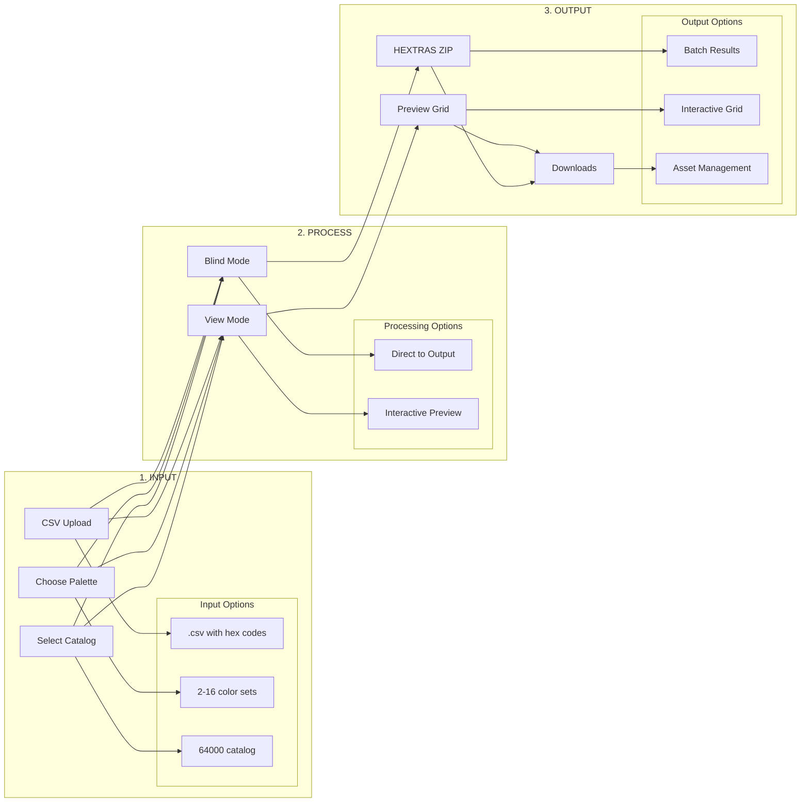

# MESMERIZE Processing Flow

## Pipeline Overview



## Key Features

### Search & Discovery
- Google-style search interface
- Color name/code search
- Smart filtering
- Search history
- Favorites/Likes system
- Tags and metadata

### Grid System
- User-defined dimensions (like Google Sheets)
- No preset limitations
- Dynamic resizing
- Custom spacing/layout

### Processing Information
- Detailed progress tracking
  - Files processed
  - Success/Error counts
  - Time estimates
  - Resource usage
- Preview caching system
- Processing history

### Output Management
- Naming: `HEXTRA-{DATE}-{FIRST_HEX}-{CAT/PAL_REF}`
- Storage duration:
  - Non-subscriber: 3 days
  - Subscriber: Indefinite
- Version tracking
- Export history

### Storage & Auto-Save
- No storage limits
- Auto-save feature
- Local cache management
- Sync for subscribers

### Viewer Integration
- Dedicated viewer component
- Toggle between VISUALIZE/MESMERIZE
- "Power Button" for direct visualization
- Library system (future)
- Like/Save functionality

### Metadata System
### Essential Metadata (Phase 1)
- **Core Color Data**
  - RGB/HEX values
  - Color name
  - Color family
  - Basic tags

- **Core Asset Data**
  - ID and timestamps
  - Basic ownership
  - Simple tagging
  - Version tracking

- **Core Relationships**
  - Color to palette
  - Palette to catalog
  - Basic grouping

### Future Metadata (Later Phases)
- HSL color space
- Digital watermarks
- QR code system
- Rights management
- Advanced relationships

### Search Integration
- Search by any metadata field
- Color relationship mapping
- Usage pattern analysis
- Family tree visualization

## Stage Details

### 1. INPUT
- **CSV Upload**
  - Direct hex code input
  - Batch processing lists
  - Template support

- **Choose Palette**
  - Small (2-5 colors)
  - Medium (6-12 colors)
  - Large (16 colors)
  - Custom grids

- **Select Catalog**
  - 64000 standard
  - Custom catalogs
  - Brand collections

### 2. PROCESS

- **Blind Mode**
  - Direct processing
  - No preview needed
  - Progress tracking
  - Batch optimization

- **View Mode**
  - Interactive preview
  - Universal Viewer
  - Real-time updates
  - Layout customization

### 3. OUTPUT

- **HEXTRAS ZIP**
  - Processed assets
  - Organized structure
  - Batch results
  - Error logs

- **Preview Grid**
  - Interactive display
  - Custom layouts
  - Zoom/Pan support
  - Selection tools

- **Downloads**
  - Asset management
  - Version control
  - Export options
  - Result history

## Implementation Priority

1. **Input Framework**
   ```
   [ ] Search System
       [ ] Google-style interface
       [ ] Color search algorithm
       [ ] History tracking
       [ ] Favorites system

   [ ] Grid System
       [ ] Dynamic grid creation
       [ ] Custom dimensions
       [ ] Responsive layouts

   [ ] Catalog Integration
       [ ] 64000 implementation
       [ ] Search indexing
       [ ] Filter system
   ```

2. **Processing Engine**
   ```
   [ ] Progress Tracking
       [ ] Detailed statistics
       [ ] Time estimates
       [ ] Error handling
       [ ] Resource monitoring

   [ ] Cache System
       [ ] Preview caching
       [ ] Auto-save
       [ ] Storage management
   ```

3. **Output System**
   ```
   [ ] Asset Management
       [ ] Naming convention
       [ ] Storage duration
       [ ] Version control
       [ ] Export options

   [ ] Viewer System
       [ ] Dedicated viewer
       [ ] VISUALIZE toggle
       [ ] Power button
       [ ] Like/Save system
   ```

## Development Phases

### Phase 1: Core Pipeline (v1.3.0)
- Search and grid system
- Basic processing
- Local storage
- Auto-save

### Phase 2: Enhanced Features (v1.3.5)
- Advanced search
- Preview caching
- Detailed progress
- Basic viewer

### Phase 3: Advanced Features (v1.4.0)
- Cloud storage
- Subscriber features
- Library system
- Advanced viewer tools
