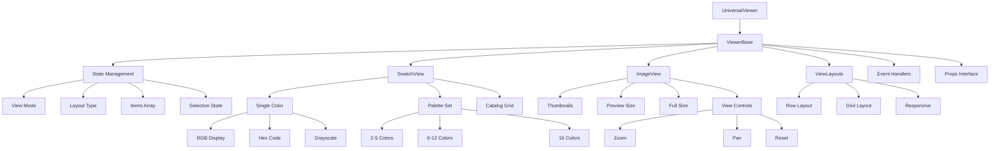
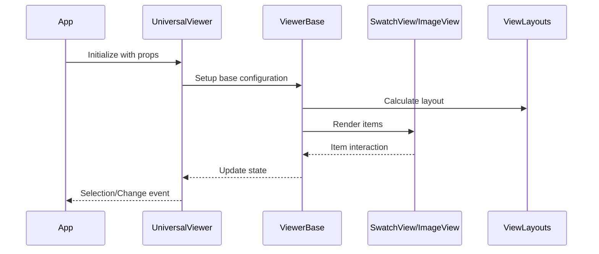

# Universal Viewer Component Architecture



## Component Flow

### 1. UniversalViewer
- Entry point component
- Handles mode selection
- Manages global viewer state
- Props:
  ```typescript
  {
    mode: 'swatch' | 'image'
    items: Array<SwatchItem | ImageItem>
    layout: 'row' | 'grid'
    onSelect: (item) => void
  }
  ```

### 2. ViewerBase
- Core functionality
- Layout management
- Event delegation
- State:
  ```typescript
  {
    viewMode: 'swatch' | 'image'
    layoutType: 'row' | 'grid'
    selectedItems: Array<Item>
    zoom: number
    pan: { x: number, y: number }
  }
  ```

### 3. SwatchView
- Color display modes
- Palette management
- Catalog display
- Features:
  ```typescript
  {
    displayMode: 'single' | 'palette' | 'catalog'
    colorFormat: 'rgb' | 'hex' | 'gray'
    interactive: boolean
    showLabels: boolean
  }
  ```

### 4. ImageView
- Image display modes
- Zoom/Pan controls
- Size management
- Features:
  ```typescript
  {
    size: 'thumb' | 'preview' | 'full'
    controls: boolean
    quality: 'low' | 'medium' | 'high'
    lazy: boolean
  }
  ```

### 5. ViewLayouts
- Layout algorithms
- Responsive handling
- Grid calculations
- Options:
  ```typescript
  {
    type: 'row' | 'grid'
    spacing: number
    columns: number
    responsive: boolean
    maxWidth: number
  }
  ```

## Data Flow



## Usage Examples

### 1. Palette Display
```jsx
<UniversalViewer
  mode="swatch"
  layout="row"
  items={paletteColors}
  onSelect={handleColorSelect}
/>
```

### 2. Catalog Grid
```jsx
<UniversalViewer
  mode="swatch"
  layout="grid"
  items={catalogColors}
  onSelect={handleCatalogSelect}
/>
```

### 3. Product Thumbnails
```jsx
<UniversalViewer
  mode="image"
  layout="grid"
  items={processedImages}
  onSelect={handleImageSelect}
/>
```

<Typography variant="h3" sx={{ 
  fontSize: '24px',
  fontWeight: 600,
  fontFamily: 'Inter, sans-serif',
  mb: 3 
}}>
  HEXTRA Color System
</Typography>

<Box sx={{ mb: 4 }}>
  <ColorPicker catalog={colorCatalog} onSelect={handleColorSelect} />
</Box>

<Divider sx={{ 
  my: 4,
  borderColor: '#e0e0e0',
  borderWidth: '1px',
  opacity: 0.8
}} />

{/* End HEXTRA Color System section */}
